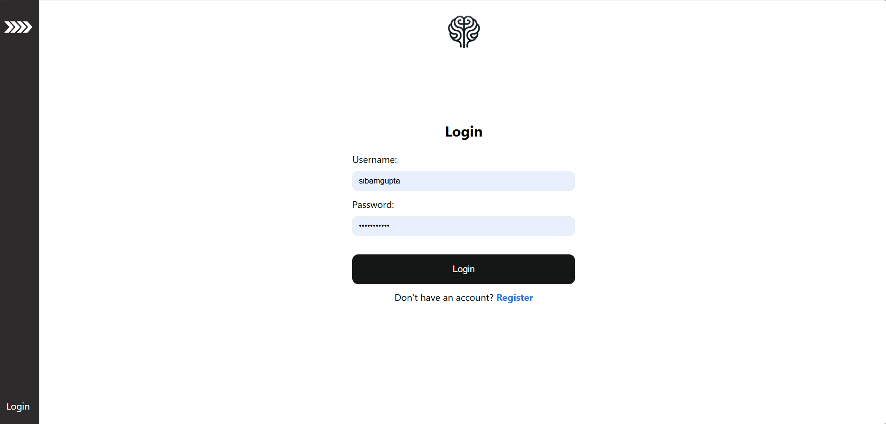

# Authentication

## Motivation
This is out of courtesy of creating a webapp. I have invested a good amount of time learning the auth system, both the default and the custom auth system in Django. So, I am creating this documentation to implement an authentication system.

## Specifications

### Intended Functionality
- Login
- Logout
- Register

## App Logic and Specification in FlowChart
 

## UI/UX Diagram using Figma
* Login View

* Register View

### Description
- **Main Dashboard**: 

## Notes on Development Steps 
* Code Notes:
* Useful Links

## Documentation
### Commit History
- *Date:* Jan 21st - Initial commit with basic layout setup.

### Thoughts

