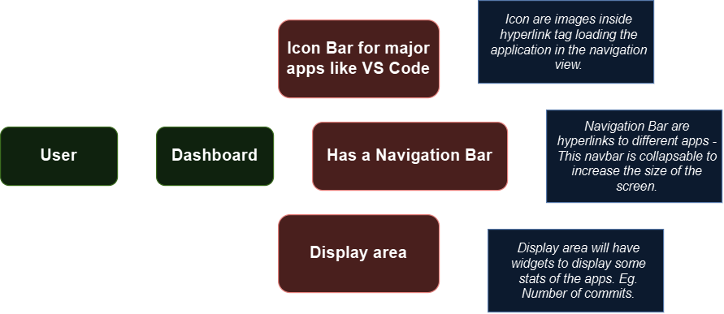
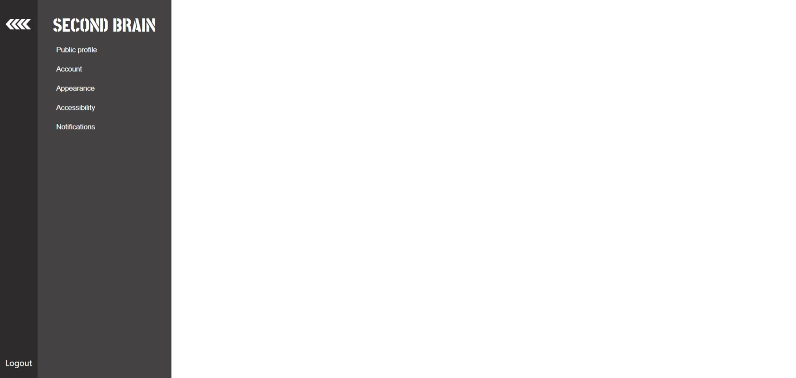

# Base Layout App

## Motivation
The base layout has been completed for both mobile and desktop version.
*Date:* Jun 29th

This is just a temporary structure of the second brain. Just so that we have a dock for every app we will make moving on.
*Date:* Jun 21st  
*Note:* If I keep looking at videos to make the best dashboard, I will be old. I will just make a layout for now.

## Specifications

### Intended Functionality
- A central dashboard that can host links or widgets for other apps.
- Basic navigation structure to switch between different apps.
- Placeholder sections for future content.

## App Logic and Specification in FlowChart

## UI/UX Diagram using Figma

## Change
* I changed the mobile design to keep it similar to that of desktop. The earlier version of mobile design needed a lot of changes and made things complicated. The current UI keeps it simple and navigable.
* Link to Old Navbar Design [Version 2: Navbar for Mobile](Navbar_Mobile.png) 
* Link to Old Navbar Design [Version 1: Navbar for Mobile](../../archive/baseLayoutChanges/Version1/MobileFrames.png) 

### Description
- **Main Dashboard**: 

## Notes on Development Steps 
* Code Notes:
* Useful Links

## Documentation
### Commit History
- *Date:* Jan 21st - Initial commit with basic layout setup.

### Thoughts

