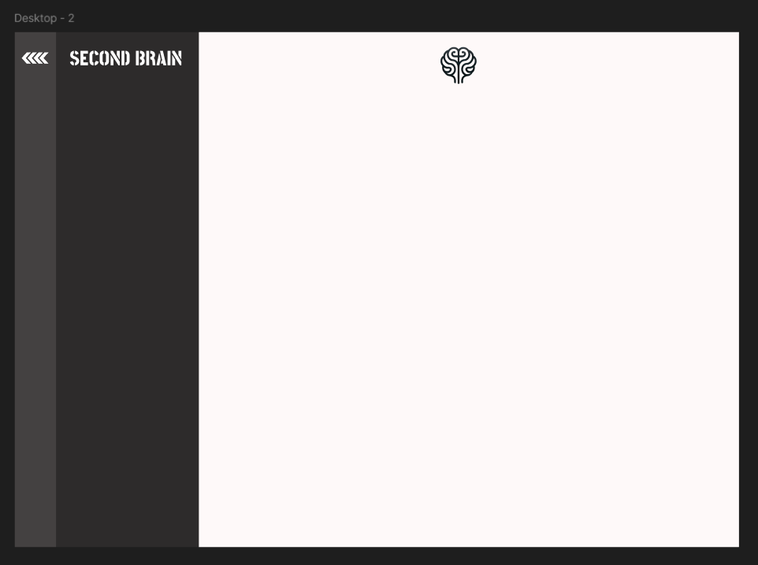
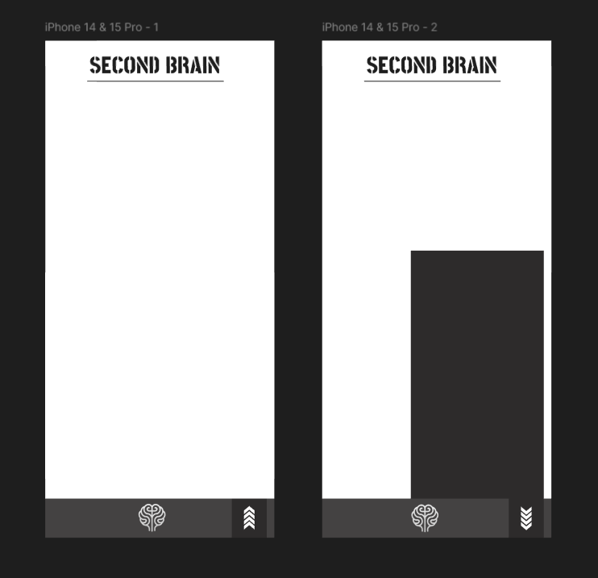

# Base Layout App

## Motivation
This is just a temporary structure of the second brain. Just so that we have a dock for every app we will make moving on.
*Date:* Jan 21st  
*Note:* If I keep looking at videos to make the best dashboard, I will be old. I will just make a layout for now.

## Specifications

### Intended Functionality
- A central dashboard that can host links or widgets for other apps.
- Basic navigation structure to switch between different apps.
- Placeholder sections for future content.

## App Logic and Specification in FlowChart
 

## UI/UX Diagram using Figma

///

### Description
- **Main Dashboard**: 

## Notes on Development Steps 
* Code Notes:
* Useful Links

## Documentation
### Commit History
- *Date:* Jan 21st - Initial commit with basic layout setup.

### Thoughts

