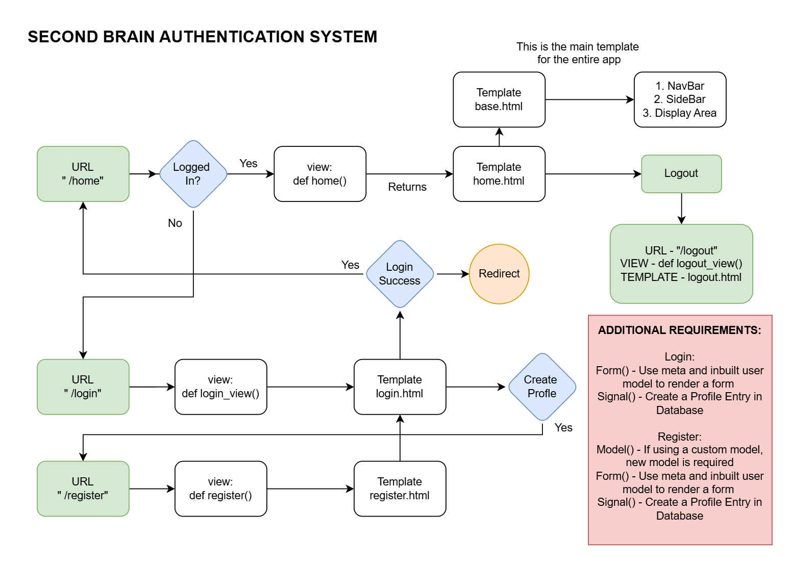
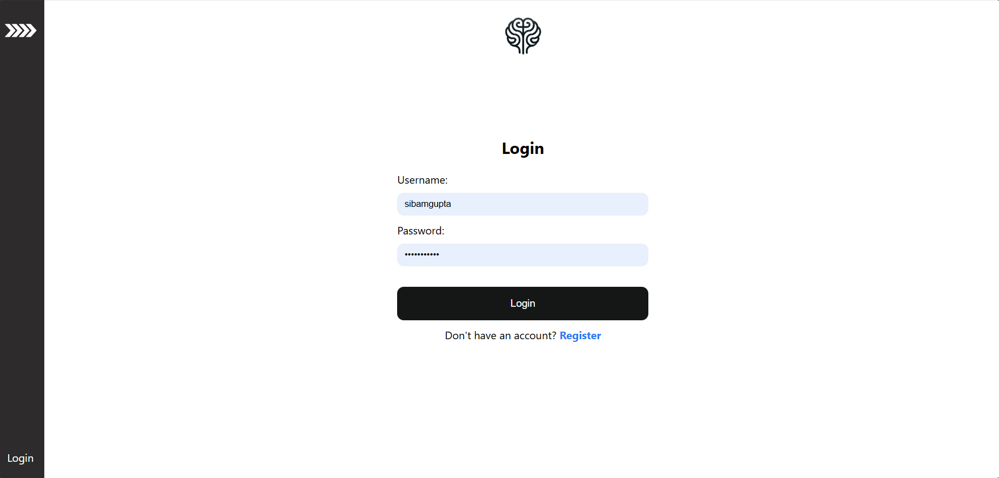
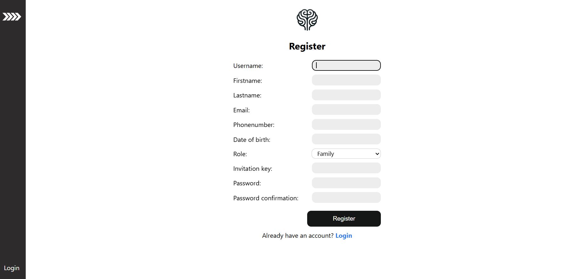

Custom Authentication System
============================

Motivation
----------
The custom authentication system is designed to provide a secure and streamlined user experience. Significant time has been invested in mastering both Django's default and custom authentication mechanisms.

Specifications
--------------

Intended Functionality
~~~~~~~~~~~~~~~~~~~~~~
- User Login
- User Logout
- User Registration

App Logic and Flowchart
~~~~~~~~~~~~~~~~~~~~~~~

UI/UX Diagram
~~~~~~~~~~~~~

Development Notes
-----------------

- **Code Notes**: Inline comments and specific implementation details.
- **Useful Links**: Links to Django documentation and other relevant resources.

Documentation
-------------

Commit History
~~~~~~~~~~~~~~
- *Date*: Jan 21st - Initial commit with basic layout setup.

Further Thoughts
~~~~~~~~~~~~~~~~
Reflections on the implementation process and future improvements.
